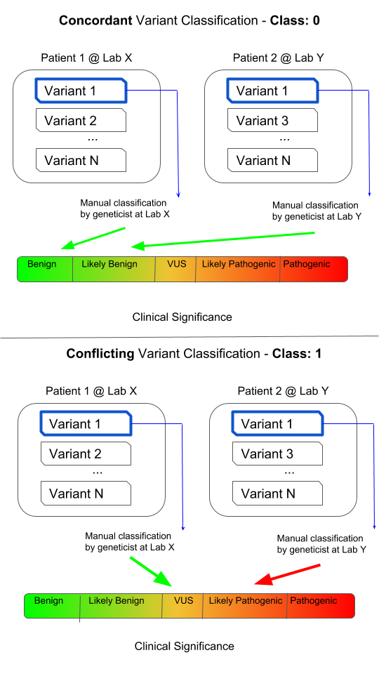

# Genetic Variant Classification (Classification)

This project was developed over two and a half weeks as part of the [Metis](https://www.thisismetis.com/) data science boot-camp in Winter 2021.

### Objective:
---

Predict whether a genetic variant is likely to be classified in a conflicting manner or not. Genetic variants are classified at labs (usually manually) in one of 5 different ways in terms of [clinical significance](https://blueprintgenetics.com/variant-classification/):

These are split into 3 categories: 
- pathogenic or likely pathogenic
- variant of uncertain significance
- benign or likely benign

When a variant is classified in a different category by separate labs, that classification is said to be “conflicting.” By identifying which gene variants are likely to be classified in a conflicting manner or not:
1. Biologists and genetics labs can better identify those variants which require further study and lab testing
2. Physicians can better plan patient treatment and respond to lab results

### Methodology and Results:
---

This project used a [dataset](https://www.kaggle.com/kevinarvai/clinvar-conflicting) located on Kaggle, containing information on genetic variants and whether they were classified in a conflicting manner or not. Classification algorithms via sci-kit learn were applied to the data in order to classify genetic variants as conflicting (1) or non-conflicting (0). The final selected features after the EDA stage of the project are given as:

- Categorical features:
	- SYMBOL – Gene name
	- CLNVC – Variant type
	- IMPACT – The impact modifier for the consequence type

- Numeric features:
	- AF_TGP – Allele frequencies from the 1000 genomes project
	- CADD_PHRED – Phred-scaled ‘deleteriousness’ score: http://cadd.gs.washington.edu/
	- LoFtool – Loss of function tolerance score for loss of function variants: https://github.com/konradjk/loftee
	- Strand – Forward or backward DNA strand, defined as + (forward) or - (reverse)

The data was separated via `train-test-split` and kNN, DecisionTree, and RandomForest classification algorithms were applied to the training and validation data. The respective ROC curves are shown below as applied to the test data. It can be seen that RandomForest performed the best on the test data, with DecisionTree not far behind, and kNN noticeably worse. Because the RandomForest model performed the best and most consistently on the training and validation data (see further plots in `code/Images/`), it was chosen as the final model. Lastly, hyper-parameter tuning was done via GridSearchCV in order to optimize the model parameters.

Recall was the optimization metric used in order to maximize true positives at the cost of false positives. To this end a threshold of 0.4 was selected over the default of 0.5. The precision and recall curves for the RandomForest model as a function of threshold can be seen below. With that choice the number of true positives was about one-half the number of false positives for the test data. The RandomForest model confusion matrices for the training and test data are shown below. The RandomForest model did have a tendency to over-fit the training data, but still performed well on the test data, achieving a final recall of 0.78. If desired, the threshold could be tuned to reduce the number of false positives at the cost of true positives, which, depending on the application and estimated cost may be a more optimal choice. Lastly, the feature importances can be seen below. The most important features in general were the numeric ones, with the 'deleteriousness' score, allele frequency, and 'loss of function' score affecting the model the most. Beyond that the impact modifier played a role in the prediction, and it can be seen that there are particular gene names that lead to more (or less) conflicting classifications (depending on the exact gene). 

| Train Data | Test Data |
| ----------- | ----------- |
|  |  |

### Tools and Techniques:
---

- scikit-learn
- Classification algorithms: kNN, DecisionTree, RandomForest
- Feature transformation: standardization and One-Hot Encoding via ColumnTransformer
- Cross validation, GridSearchCV
- Matplotlib and Seaborn for visualization
- SQL, PostgreSQL (though not for the main part of the project)

### File Details:
---

- `code/`

	- `doClassification.ipynb` - main code which fits the classification models on the train and test data, outputs plots and results
	- `modelEvalUtils.py` - file which provides various plotting and metric evaluation methods
	- `feature_importance.py` - file written by Kyle Gilde which provides feature names after data has been passed through `ColumnTransformer` pre-processors (including One-Hot Encoding steps), see [here](https://towardsdatascience.com/extracting-plotting-feature-names-importance-from-scikit-learn-pipelines-eb5bfa6a31f4) for an explanation and link to the code
	- `pipelineEDA.ipynb` - notebook used for exploring data processing through various pipelines and sklearn modules including ColumnTransformer and GridSearchCV 
	- `initialEDA.ipynb` - notebook used for feature and data exploration

- `Data/`

	- `clinvar_conflicting.csv` - [dataset](https://www.kaggle.com/kevinarvai/clinvar-conflicting) used for analysis
	- `featureExplanation.txt` - explanation of various features

- `SQL_Challenges/`

	- this folder contains files related to SQL coding work which was part of the Metis project requirements, but which does not relate to the scope of the project

